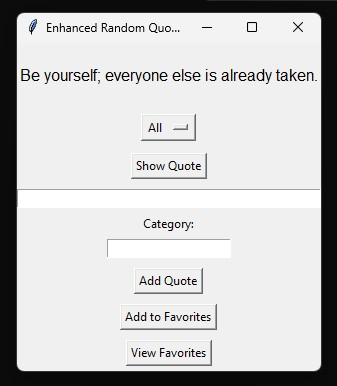

\# Enhanced Budget Tracker


A beginner-friendly Python GUI application to track your personal budget.


\## Features


\- Add income and expenses with categories

\- View total expenses and balance

\- Summary report by category

\- Persistent storage in JSON


\## How to Run


```bash

python budget\_tracker\_gui.py


Skills Demonstrated

* Python GUI (Tkinter)
* File handling (JSON)
* Loops, functions, and user input
* Data organization and reporting


## Screenshot

